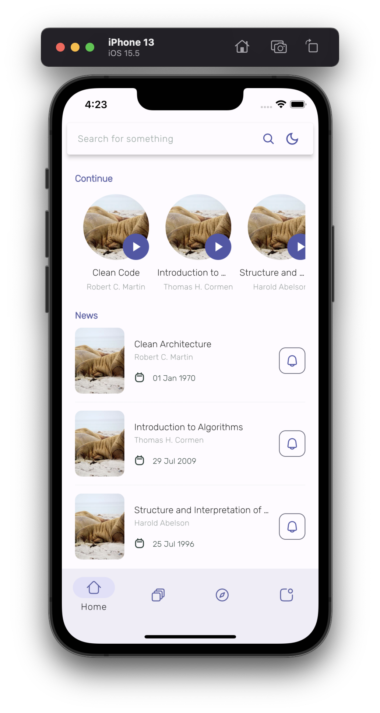
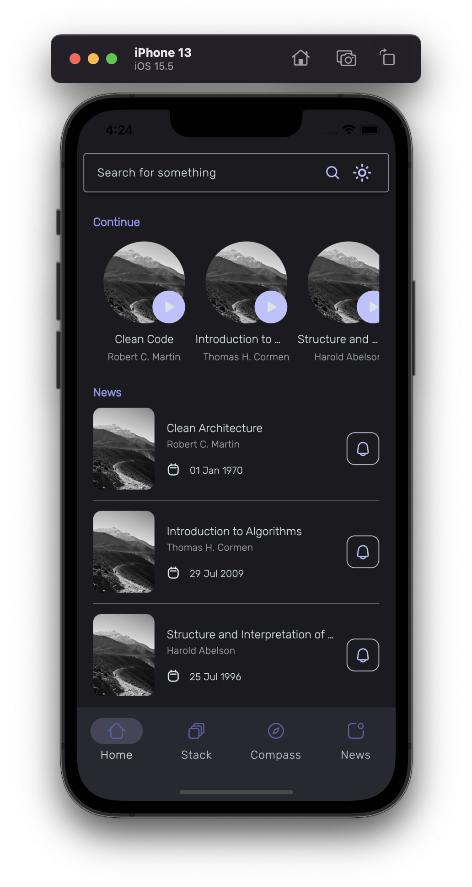
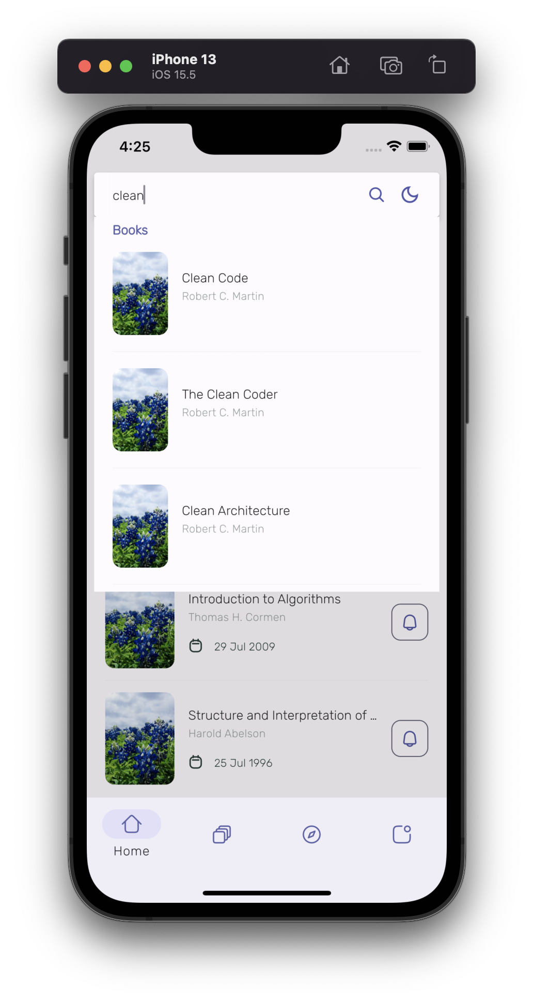
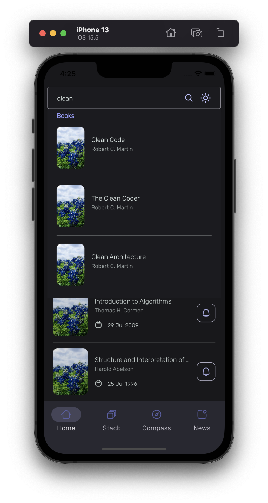
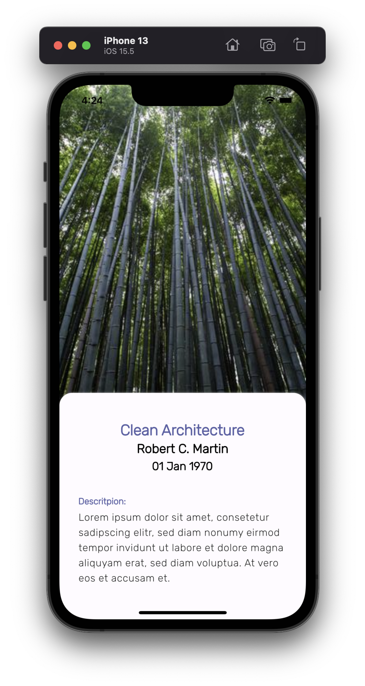
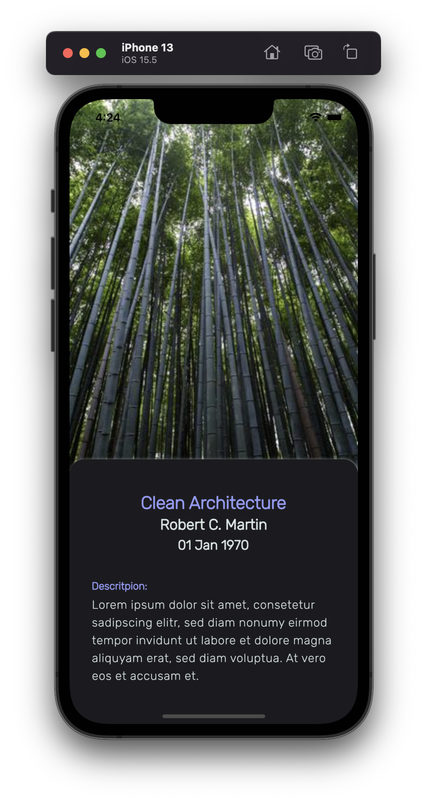

## Project
Reos Coding Challenge 


## Software Toolchain

Minimal Requirments:

- Flutter stable, v3.0.5
- Dart 2.17.6
- DevTools 2.12.2
- Xcode 13.4.1
- Android Studio Arctic Fox | 2020.3.1 Patch 4 
- Cocoapods 1.11.2

Build tools
- gradle 7.0.4

 utilized IDE:
- VS Code


Utilized Git Clients:
- Git Kraken
- VS Code


## App Features 

A Screencast [video](documentation/screenCast.mov) of the app is provided in the /documentation folder 

### Homescreen

As shown ini the figma design, this screen shows a searchbar textfield in the top which accepts user input.

By default, this screen shows a horizontally scrollable list of 'continue' items
and a 'news' list of vertically scrollable items.
The news list items are interactive and open a simple detail screen of the respective book.

 


### Search

the search returns book objects. The data is mocked using a FakeRepository to fetch, which may be replaced with a real Api class when a backend is provided. There is an artificial delay implementedTo further simulate an Api call. 

 



#### Data model Book - example
The images are provided by picsum.photos
```sh
{
   "id":"1",
   "title":"Clean Code",
   "author":"Robert C. Martin",
   "imageUrl":"https://picsum.photos/300/400",
   "publishDate":1217541600000,
   "description":"Lorem ipsum dolor sit amet, consetetur sadipscing elitr, sed diam nonumy eirmod tempor invidunt ut labore et dolore magna aliquyam erat, sed diam voluptua. At vero eos et accusam et."
}
```

### Detail Screen

a simple detail screen is implemented.

 



### Theming
Dark and light theme were implemented in theme_provider.dart. 
The app defaults to the system settings of the phone. A theme icon in the top right of the home screen allows the user to toggle it.

## Navigation
The project uses go_router which is an implementation of Nav2.
This allows a deal of control over the uri for web use as well as deeplinking. This is implemented in app_router.dart


## Running the Project

If using the terminal, first ensure that all dependencies are installed:

```sh
$ flutter pub get
```

To ensure a clean build, make sure that all previous builds are removed:

```sh
$ flutter clean
```

To run in debug mode,  run:

```sh
$ flutter run -t lib/main.dart
```


To build in release mode,  run:

```sh
$ flutter run -t lib/main.dart --release
```

To run the app for all connected devices/simulators, run:

```sh
$ flutter run -d all
```

to perform hot reload as the app is running, type
```sh
$ r
```

for more info on build modes, please see (https://flutter.dev/docs/testing/build-modes)


## Testing
### To cover the test pyramid, the following tests are provided:
- unit tests
- widget tests
- integration tests

for the widget and unit tests please run
```sh
$ flutter test
```

Integration tests are  provided in the folder integraion_tests in the root directory


## State Management
This project uses the Provider Package with ChangeNotifier. For more details please see https://pub.dev/packages/provider

## other dependencies

for navigation 2: go_router: ^4.2.7
for rendering SVGs: flutter_svg: ^1.1.3
for rendering a floating searchbar: material_floating_search_bar: ^0.3.7

## dev dependencies
for integration tests: integration_test
for mocking dependencies: mockito: ^5.3.0 (which needs build_runner: ^2.2.0)
for mocking newtwork images: network_image_mock: ^2.1.1
## Linting rules
tapped_lints:

## FVM
with version 3.0.5

## CI
Github Actions are implemented for each Pull request. see [the workflow](.gihub/workflows/ci.yml)  


#4 note
when running the project, the following warning is thrown.
This is a common warning at the moment caused by a library (floating search bar) that is not yet adapted to the changes in Flutter 3.
For further info, please see:
please see https://stackoverflow.com/questions/72239258/flutter-warning-operand-of-null-aware-operation-has-type-widgetsbinding

```sh
: Warning: Operand of null-aware operation '?.' has type 'WidgetsBinding' which excludes null.
../…/util/util.dart:21
- 'WidgetsBinding' is from 'package:flutter/src/widgets/binding.dart' ('../../../flutter/packages/flutter/lib/src/widgets/binding.dart').
package:flutter/…/widgets/binding.dart:1
  WidgetsBinding.instance?.addPostFrameCallback((_) => callback());
```